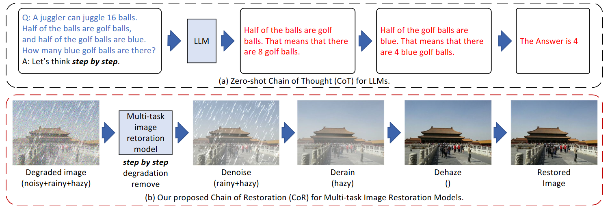

#  Chain-of-Restoration: Multi-Task Image Restoration Models are Zero-Shot Step-by-Step Universal Image Restorers

> **Abstract:** *Despite previous works typically targeting isolated degradation types, recent research has increasingly focused on addressing composite degradations which involve a complex interplay of multiple different isolated degradations. Recognizing the challenges posed by the exponential number of possible degradation combinations, we propose Universal Image Restoration (UIR), a new task setting that requires models to be trained on a set of degradation bases and then remove any degradation that these bases can potentially compose in a zero-shot manner. Inspired by the Chain-of-Thought which prompts LLMs to address problems step-by-step, we propose the Chain-of-Restoration (CoR), which instructs models to step-by-step remove unknown composite degradations. By integrating a simple Degradation Discriminator into pre-trained multi-task models, CoR facilitates the process where models remove one degradation basis per step, continuing this process until the image is fully restored from the unknown composite degradation. Extensive experiments show that CoR significantly improves model performance in removing composite degradations, achieving results comparable to or surpassing those of State-of-The-Art (SoTA) methods trained on all degradations.*

